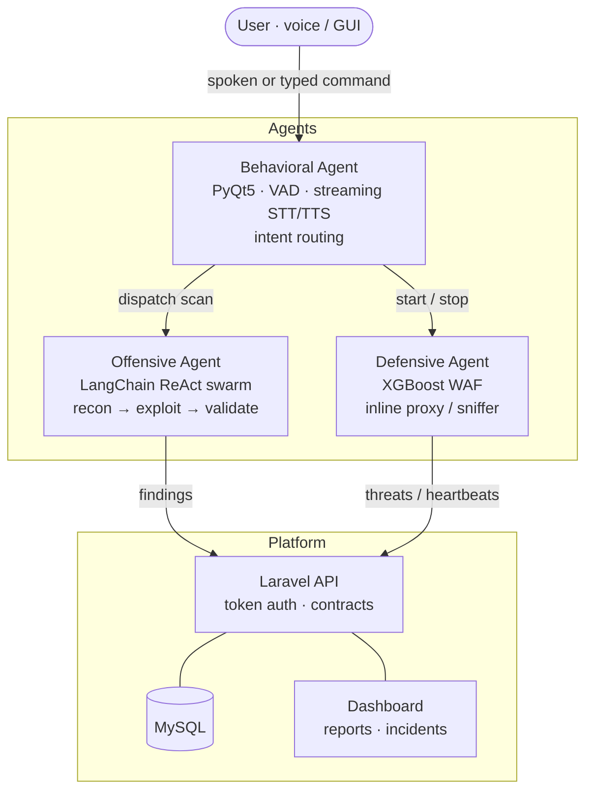
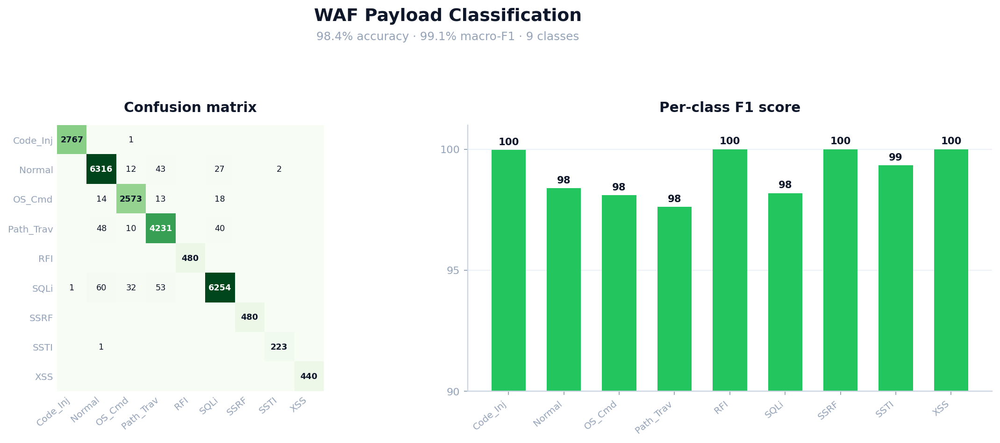
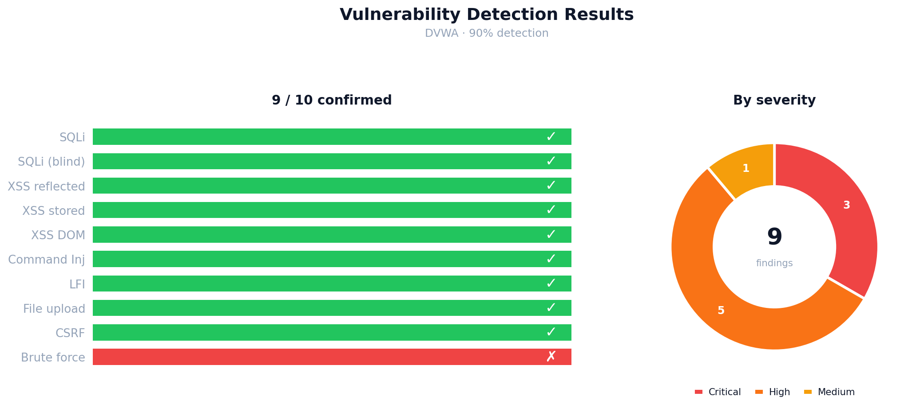

# Bingo — Autonomous AI Security Engineer

> An AI system that acts like a security engineer: it finds and exploits web
> vulnerabilities, defends live traffic with a machine-learning WAF, and is
> driven entirely by voice and a real-time dashboard.


Bingo combines three autonomous agents behind one conversational assistant and a
central platform. You ask it — by voice or text — to scan a target, and it runs a
full reconnaissance-to-exploitation pipeline; you ask it to defend, and it brings
up a real-time WAF that classifies and blocks malicious traffic. Every result is
reported to a Laravel dashboard over an authenticated API.

---

## Architecture



| Agent | What it does | Core tech |
|-------|--------------|-----------|
| **Offensive** | Autonomous recon → attack-surface mapping → parallel exploit swarm → deterministic validation | LangChain ReAct, Playwright, FAISS+BM25 RAG |
| **Defensive** | Classifies every HTTP request and blocks malicious traffic inline or via a passive sniffer | XGBoost, char n-gram TF-IDF |
| **Behavioral** | Voice/GUI assistant that understands commands and orchestrates the other agents | PyQt5, webrtcvad, OpenAI STT/TTS |
| **Platform** | Collects reports, incidents and heartbeats; serves the dashboard | Laravel, MySQL |

All LLM roles run on **`gpt-4o-mini`** for cost and rate-limit safety.

---

## Highlights

<table>
<tr>
<td width="50%">

**Defensive — ML WAF**
<br/>



98.4% accuracy · 99.1% macro-F1 across 9 traffic classes.

</td>
<td width="50%">

**Offensive — detection on DVWA**
<br/>



9 / 10 vulnerability classes confirmed · 100% precision after validation.

</td>
</tr>
</table>

- **Offensive:** maps the full attack surface (100% module coverage on DVWA), confirms findings with a deterministic validator (zero false positives), and runs its exploit agents in parallel for a **2.3× speedup**.
- **Defensive:** deployed at a 0.70 confidence threshold for **99.3% detection at 1.2% false positives**, with ~5 ms inline-proxy overhead.
- **Behavioral:** continuous voice loop with **~1 s to first audio**, 92% speech-recognition accuracy and 93% intent-routing accuracy.
- **Cost:** the entire project ran on **$6.52** of API usage (26.3M tokens, 97.5% on `gpt-4o-mini`).

See [`evaluation/`](evaluation/) for the full chart set and how the numbers were produced.

---

## Repository layout

```
Ai-Agent/                 The three agents + integration layer
├── Bingo_Agent.py        Behavioral agent (PyQt5 voice/GUI)
├── voice_io.py           Low-latency mic capture + streaming TTS
├── Offensive-Agent/      ReAct exploit swarm, recon, RAG, validator
│   └── knowledge_base/    Vulnerability & tool knowledge (RAG source)
├── Defensive-Agent/      XGBoost WAF engine, features, network monitor
└── integration/          Dispatcher, intent router, reporting client
Back-end/                 Laravel API + dashboard backend
Front-end/                Static dashboard (HTML/JS)
Testing_WAF/              WAF training pipeline
evaluation/               Evaluation scripts + result charts
docker-compose*.yml       Full stack + agent services
```

Each folder has its own `README.md` with details.

---

## Quick start

### Prerequisites
- Docker + Docker Compose
- An OpenAI API key
- (For the voice assistant) Python 3.12 on the host with a microphone

### 1. Configure secrets
Copy the templates and fill in your keys:

```bash
cp Ai-Agent/.env.example Ai-Agent/.env
cp Back-end/.env.example Back-end/.env
```

Set `OPENAI_API_KEY` in `Ai-Agent/.env`. The dashboard access token
(`REPORTING_API_KEY`, starts with `bingo_ak_`) is generated from the dashboard
once it is running.

### 2. Bring up the stack
```bash
docker compose -f docker-compose.yml -f docker-compose.agent.yml up -d db app webserver frontend dvwa
```

| Service | URL | Default local credentials |
|---------|-----|---------------------------|
| Dashboard | http://localhost:5500 | `admin@bingo.local` / `BingoAdmin2026!` |
| API | http://localhost:8000 | — |
| DVWA (lab target) | http://localhost:4280 | `admin` / `password` |

> These are **local development defaults** — change them before exposing the
> stack anywhere non-local.

### 3. Run a headless scan
```bash
docker compose -f docker-compose.yml -f docker-compose.agent.yml run --rm agent python docker_scan.py
```

### 4. Run the voice assistant (on the host)
The behavioral agent needs a real microphone, so it runs outside Docker:

```bash
start.bat            # sets up the virtualenv and dependencies, then launches
```

The RAG knowledge base **rebuilds itself from `knowledge_base/` on the first
scan**, so no prebuilt index ships with the repo.

---

## Tech stack

**Agents:** Python 3.12, LangChain (ReAct), OpenAI (`gpt-4o-mini`, transcribe, TTS),
XGBoost, scikit-learn, Playwright, webrtcvad, PyQt5, FAISS + BM25.
**Platform:** Laravel, MySQL, Nginx.
**Infra:** Docker Compose. **Lab target:** DVWA.

---

## Evaluation

```bash
cd evaluation
pip install -r requirements.txt
python run_all.py        # regenerates every chart in evaluation/charts/
```

---

## Disclaimer

Bingo is an **offensive security research and educational project**. Only run it
against systems you own or are explicitly authorized to test (the included DVWA
lab is provided for exactly this purpose). Using these tools against systems
without permission is illegal. The authors accept no liability for misuse.

## License

Released under the [MIT License](LICENSE) © 2026 Bingo-Team. Note that
permissive licensing covers copyright only — it does not authorize unlawful use
(see the disclaimer above).
